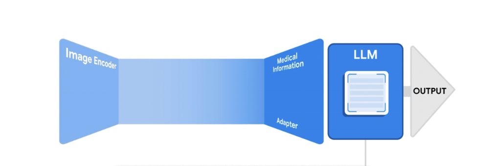
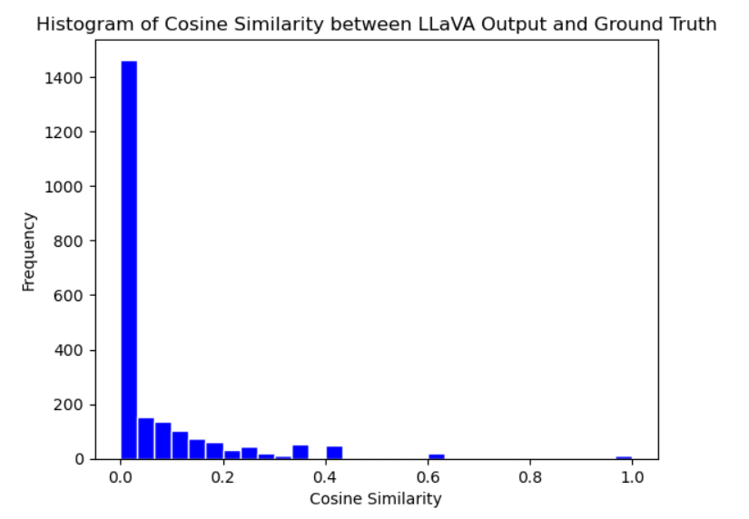
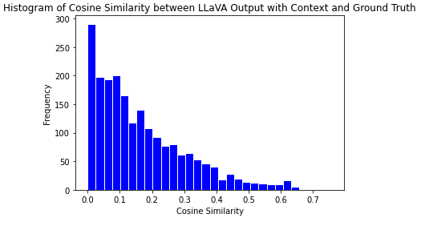

# Medical Diagnosis Assistant: Integrating Neural Networks and Language Models for Automated Analysis of X-Rays

## About

In the radiology world, radiologists must analyze an ever-increasing volume of X-ray images on a daily basis due to the exponential rise of medical imaging. This demanding pace not only poses challenges for accurate diagnosis but also strains the efficiency and effectiveness of healthcare delivery. Recognizing the pressing need for transformative solutions in this domain, we aim to automate  this process by creating a way to use a Large Language Model (LLM) to analyze X-ray image input and generate a text radiology report, similar to ChatGPT. By applying this technology to the field of radiology, we seek to augment diagnostic accuracy while optimizing the operational workflow of this area of healthcare for the benefit of both radiologists and patients.

## Methods

### Data

We analyzed approximately 23,000 X-Ray images from patients at UC San Diego Health collected over the years. We also had patient history data, diagnosis from the X-Ray images, and other demographic clinical data that we used to analyze the X-Ray image diagnoses. 

#### LLaVA (Large Language and Vision Assistant): 
A large multi-modal model that combines a vision encoder and Vicuna LLM that achieves impressive chat capabilities.

    

#### Baseline Model: 
Building off of the LLaVA framework, we fine-tuned the model on a dataset of 23,000 X-ray images with findings and impressions only.

#### Final Model:
We fine-tuned a model built off of LLaVA on a larger set of 100,000 X-ray image data with patient clinical history as well as authorship of reports incorporated.

## Example Inference

**Prompt**: Given this radiology report. Could you provide a detailed interpretation of the findings in this chest X-ray?

    
     
    Baseline Model

**Radiology Report**: Enlarged cardiac silhouette, as before. enlarged central pulmonary arteries, consistent with pulmonary hypertension. left midlung and bibasal streaky densities consistent with subsegmental atelectasis or scarring.

**LLaVA**: Findings of pulmonary hypertension with pulmonary edema.

    
     
    Final Model

**Radiology Report**:  Lines and Tubes: Unchanged support devices. Swan-Ganz catheter terminates in the right pulmonary artery.  Mediastinum: The cardiomediastinal silhouette is stably enlarged.  Lungs: Mild interstitial edema. Left midlung atelectasis or scarring.  Pleura: No pneumothorax or effusion.  Bones and soft tissues: Unchanged

**LLaVA**: Lines and Tubes: Unchanged support devices. Swan-Ganz catheter terminates in the right pulmonary artery.  Mediastinum: The cardiomediastinal silhouette is unchanged.  Lungs: Mild pulmonary edema, similar to prior.  Pleura: No pneumothorax or effusion.  Bones and soft tissues: Unchanged.

## Evaluation Metrics

### NLP Techniques and Similarity Scoring
We applied traditional NLP techniques and compared both models with the ground truth (radiologist reports) using similarity scores. Specifically, we vectorized the text reports using Term Frequency - Inverse Document Frequency (TF-IDF) and performed cosine similarity to produce a similarity score that quantifies model performance in terms of sentence structure development and general similarity to real radiology reports. 

### OpenAI GPT-3.5 Turbo:
To assess the accuracy of model-generated reports across various disease entities, we employed the GPT-3.5 Turbo model developed by OpenAI. The use of LLM facilitated the extraction of the presence and severity of each disease entity from both the original reports and generated reports. Then, we quantified the model's accuracy by comparing the severity classes identified in the generated reports against those in the original reports. This approach may offer a more effective approach to evaluating diagnostic accuracy and severity assessment of disease entities, due to its enhanced ability to interpret complex sentence structures and contexts, which could potentially improve upon the limitations of traditional NLP methods.

## Results

#### NLP Similarity Scores Evaluation:
Baseline model performance - TF-IDF encoding and cosine similarity:

    

Final model with clinical context performance - TF-IDF encoding and cosine similarity

    

When comparing the cosine similarity scores between the model output and radiology reports for both the baseline and final model test sets, we observed a notable improvement in scores in the final model. As seen in Figure 4 and Figure 5, the final observes more unique values and improved cosine similarity scores with the integration of clinical context and an increase in the size of the training data. This stark difference in results parallels the vital importance of patient clinical history in real-world radiologist impressions as well as the impact of training data size on model performance.

#### LLM-assisted Evaluation: 
Baseline and Final Model performance by disease entity (F1 score):

    

A comparative analysis of performance between the baseline and final model evaluated by ChatGPT 3.5 Turbo demonstrates an improvement in accuracy across all six disease entities examined. The final model still demonstrate a bias toward the "none" class across the severity spectrum for all six disease entities, as illustrated in the figure above. This inclination may stem from an insufficient address of class imbalance prior to training, given that the dataset is disproportionately skewed toward the "none" class. Further tuning of the model should therefore integrate techniques to handle the class imbalance issue to improve model precision.

## Conclusion

The traditional NLP method of evaluation provides a way of comparing the overall similarity of the LLaVA generated reports to the ground truth of radiologist reports. However, it may fall short in accurately extracting detailed semantics.Therefore, the incorporation of LLM-assisted evaluation becomes essential. The adeptness of LLMs in parsing complex linguistic structures enables the automated extraction of sentiment from intricate sentence constructions within the reports. This offers a nuanced assessment of the diagnostic accuracy addressing specific diseases, but still exhibits a lack of consistency that needs to be further addressed in subsequent research. For future directions, a more thorough comparative analysis should be done to test various state-of-the-art Large Language Models (LLMs) in evaluating model performance. This can provide valuable insights into the relative strengths and weaknesses of different LLMs on parsing medical reports and assessing diagnostic accuracy of medical LLMs. Additionally it may be valuable to personalize the model output to the user through prompting so that reports are in the voice of a particular radiologist and impressions are true to their x-ray reading style. 

## The Team
Sally Yu, Eudora Fong, Aishani Mohapatra[Aishani Mohapatra](https://www.linkedin.com/in/aishani-mohapatra/)

